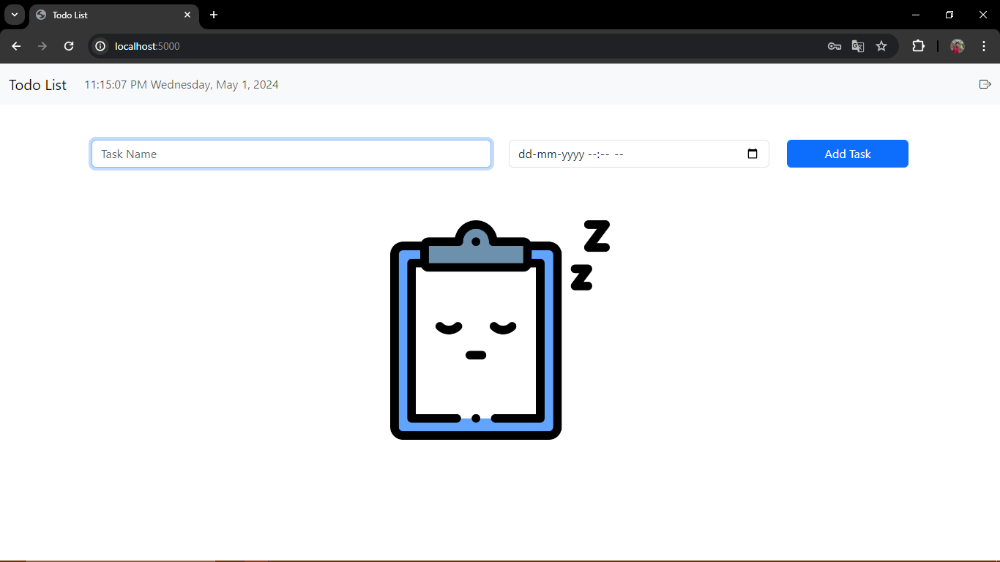
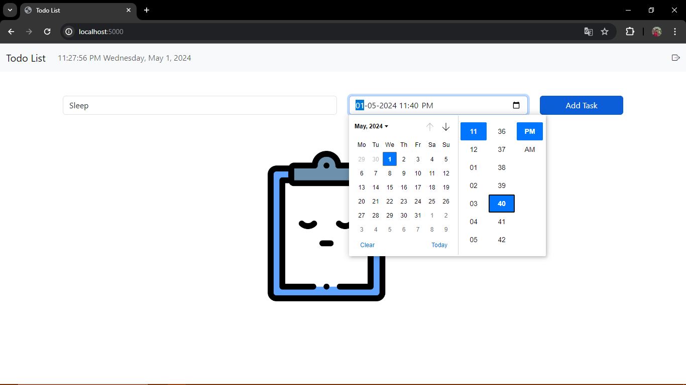
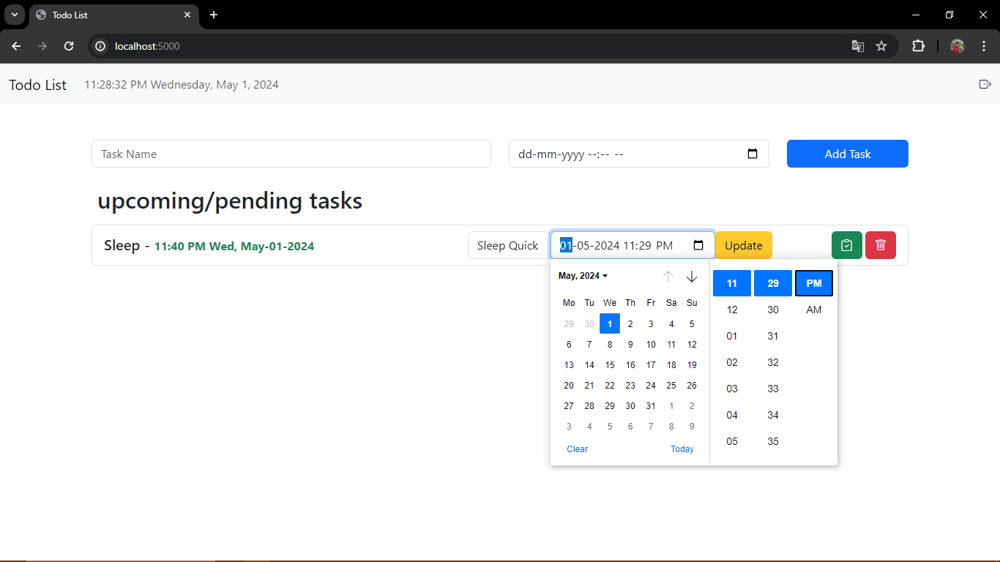
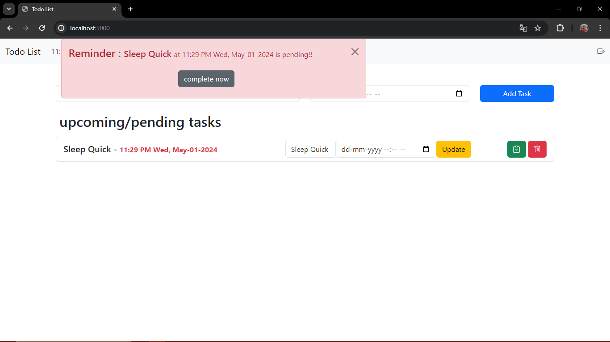
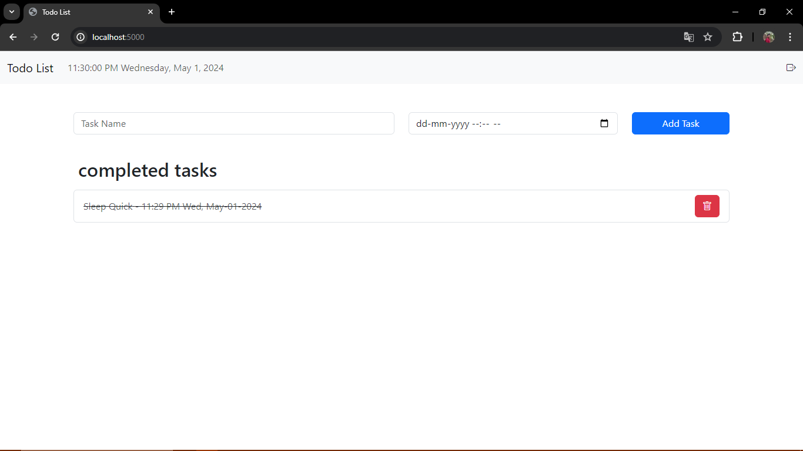
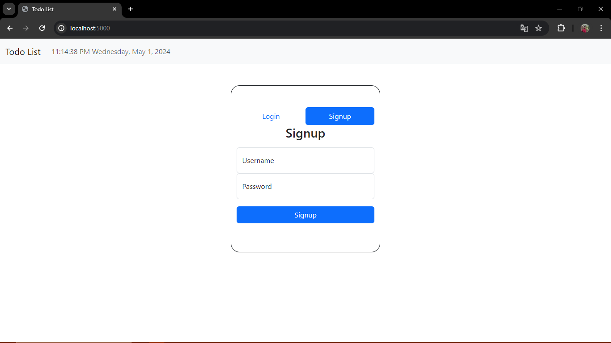
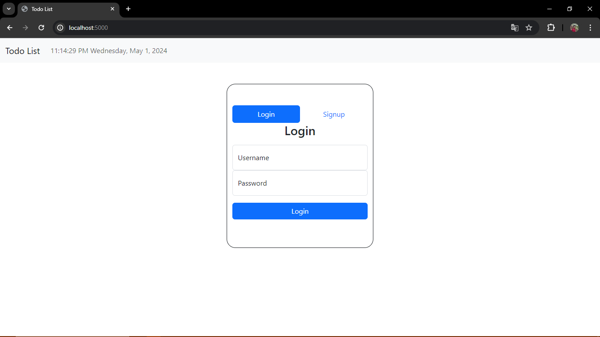
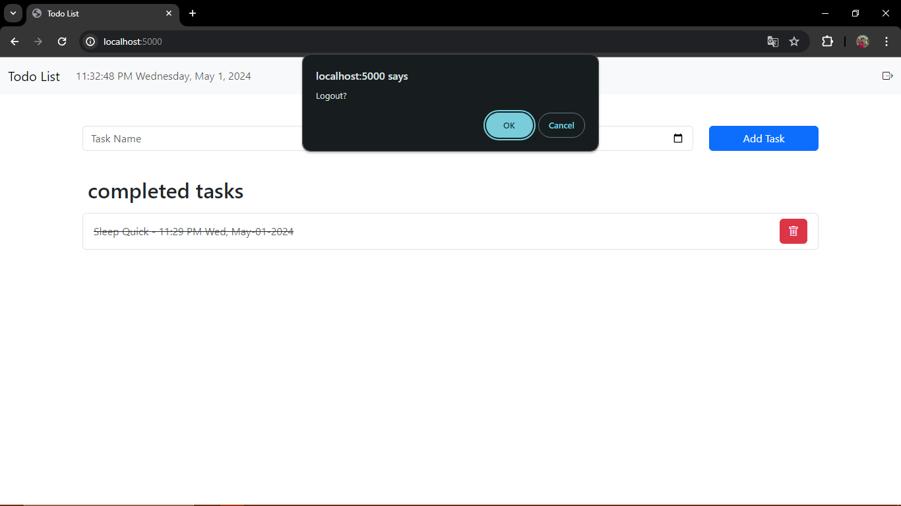

# Todo List Web Application

This is a simple Todo List web application built using Flask and MongoDB. It allows users to create, update, delete, and mark tasks as they completed. It also alerts the user when a certain task is pending.

## Features

- User Authentication: Users can register, login, and logout.
- Task Management: Users can add new tasks, update existing tasks, delete tasks, and mark tasks as completed.
- Real-time Task Display: Tasks are displayed with their completion status and the time left for completion.

## Technologies Used

- Flask: Python web framework for building the backend.
- MongoDB: NoSQL database for storing user data and tasks.
- HTML/CSS: Frontend styling and structure.
- JavaScript: For client-side interactivity and real-time updates.
- Bootstrap Dependencies and Icons.

## Screenshots

### Home Page

### Task Creation

### Task Update

### Task Reminder

### Task Completed

### Signup, Login & Logout

## Installation

1. Clone the repository: https://github.com/aswin-krishna-m/ADBMS_LAB.git

2. Install Python and MongoDB on your system if not already installed. 

3. Install the required dependencies: pip install -r requirements.txt

4. Run the Flask application: python app.py

5. Access the application in your web browser at `http://localhost:5000`.

## Usage

- Register or login to access the Todo List functionality.
- Add new tasks by providing a task name and completion deadline.
- Update tasks by editing their name or deadline.
- Mark tasks as completed or delete them as needed.

## Contributing

Contributions are welcome! If you find any bugs or have suggestions for improvements, please open an issue or submit a pull request.

## License

This project is licensed under the [MIT License](LICENSE).

